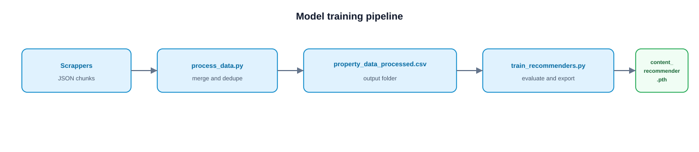
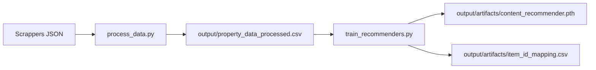

# PropertyWalay — Model Training

Content-based property recommender: merge scraper JSON, build a training CSV, compare similarity models, export PyTorch embeddings for similar-listing recommendations.

**No `.env` in this folder** — paths only via CLI flags (default scraper input: `../Scrappers`).

<p align="center">
  
</p>

## Pipeline



| Step | Script | Output |
|------|--------|--------|
| 1 | `process_data.py` | `output/property_data_processed.csv` + quality report |
| 2 | `train_recommenders.py` | `output/artifacts/content_recommender.pth`, `item_id_mapping.csv` |

One command for both steps:

```bash
python run_training.py
```

## Prerequisites

- Python 3.11+
- Scraper JSON at `../Scrappers/Graana/Data`, `Lamudi/Data`, `Zameen/Data` (run `../Scrappers/run_all.py` first)

## Setup

```bash
cd "Model Training"
python -m venv venv
venv\Scripts\activate
pip install -r requirements.txt
```

## Usage

### Full pipeline

```bash
python run_training.py
```

### Step by step

```bash
python process_data.py --scrapers-dir ../Scrappers
python train_recommenders.py
python train_recommenders.py --skip-eval
python train_recommenders.py --max-rows 50000 --skip-eval
```

### CLI flags (no environment variables)

| Flag | Script | Default |
|------|--------|---------|
| `--scrapers-dir` | `process_data.py`, `run_training.py` | `../Scrappers` |
| `--output-dir` | `process_data.py` | `./output` |
| `--csv-path` | `train_recommenders.py` | `./output/property_data_processed.csv` |
| `--artifacts-dir` | `train_recommenders.py` | `./output/artifacts` |
| `--max-rows` | `train_recommenders.py` | full dataset |
| `--skip-eval` | `train_recommenders.py` | run evaluation |
| `--skip-process` | `run_training.py` | skip processing |
| `--skip-train` | `run_training.py` | skip training |

## Models evaluated

`train_recommenders.py` benchmarks cosine/euclidean similarity (numeric, categorical, PCA, SVD), plus KMeans/GMM cluster rankers, using Recall@10/20 and MRR@10/20. Export uses **numeric PCA** embeddings (dense, deployable).

## Layout

```
Model Training/
├── run_training.py
├── process_data.py
├── train_recommenders.py
├── training_utils.py
├── requirements.txt
├── .gitignore
└── output/                 # gitignored
    ├── property_data_processed.csv
    └── artifacts/
        ├── content_recommender.pth
        └── item_id_mapping.csv
```

## Integration

Copy `output/artifacts/*` into your serving layer when wiring similar-property recommendations. Offline training only; the live API lives under `backend/`.
