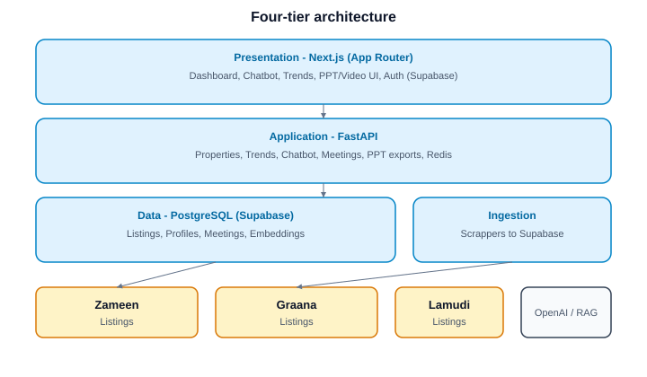
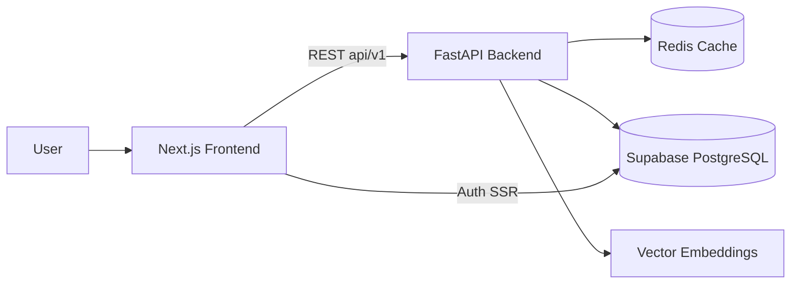
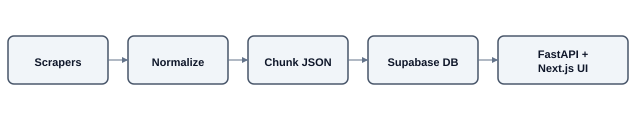
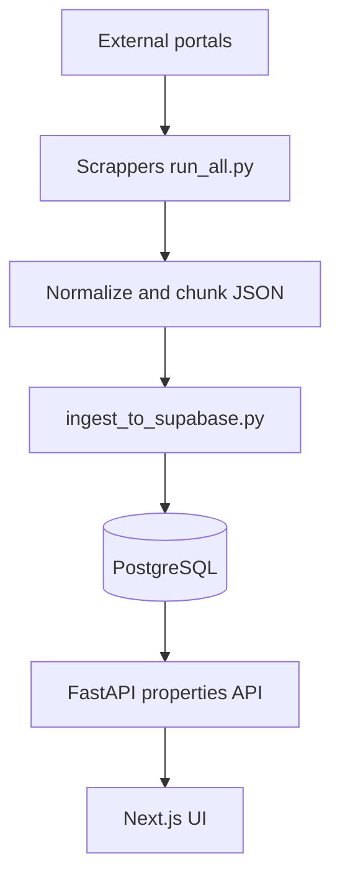
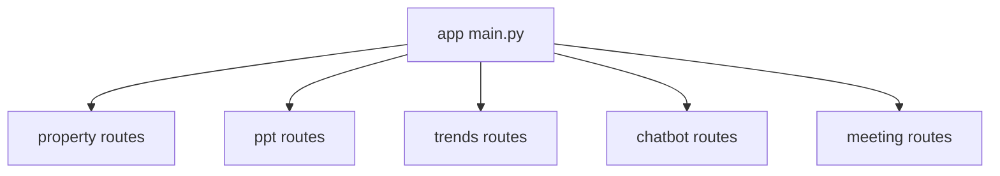

<p align="center">
  
</p>

<p align="center">
  <strong>AI-powered real estate platform for Pakistan</strong><br/>
  Unified search · multilingual chatbot · market trends · agent automation
</p>

<p align="center">
  <a href="#features">Features</a> ·
  <a href="#architecture">Architecture</a> ·
  <a href="#getting-started">Getting started</a> ·
  <a href="#project-structure">Structure</a> ·
  <a href="#api-overview">API</a> ·
  <a href="#license">License</a>
</p>

---

## Overview

**PropertyWalay** aggregates live property listings from major Pakistani portals (Zameen, Graana, Lamudi), exposes them through a modern web app, and layers AI on top: natural-language search (English & Roman Urdu), RAG-based recommendations, price/trend analytics, automated agent meetings, and export tools (PowerPoint decks, location videos).

| Problem | Solution |
|--------|----------|
| Fragmented listings across sites | Scrapers + single Supabase/Postgres catalog |
| Complex filters & language barriers | NLU chatbot + voice-friendly queries |
| Stale or duplicate data | Scheduled ingestion pipeline |
| Slow agent workflows | Meeting scheduling, PPT/video generation |
| Opaque market pricing | Trends module with charts & maps |

---

## Features

- **Real-time aggregation** — Listings ingested from Zameen, Graana, and related sources via `Scrappers/`.
- **AI chatbot** — Property search and Q&A backed by the FastAPI chatbot routes and embeddings.
- **Dashboard** — Search history, saved flows, meetings, settings, and profile (Supabase Auth).
- **Market trends** — Area-level analytics, charts, maps, and top movers (`/dashboard/trends`).
- **PPT export** — One-click property presentation decks for agents.
- **Video generation** — Location-based property videos for remote buyers.
- **Meetings** — Schedule and track buyer–agent meetings.
- **Multilingual UX** — English and Roman Urdu–friendly interaction patterns.

---

## Architecture

High-level system layout (four tiers):

<p align="center">
  
</p>

<!-- SVG source (GitHub also supports): docs/assets/architecture.svg -->

### Request flow (user to listing)



### Data ingestion pipeline

<p align="center">
  
</p>



### Module map (backend)



---

## Tech stack

| Layer | Technologies |
|-------|----------------|
| **Frontend** | Next.js 16 (App Router), React 19, TypeScript, Tailwind CSS 4, shadcn/ui, Zustand, Supabase SSR |
| **Backend** | FastAPI, SQLAlchemy, Pydantic, Redis, python-pptx |
| **Database** | PostgreSQL via Supabase (profiles, listings, meetings, embeddings) |
| **Scrapers** | Python (`Scrappers/`) |
| **AI** | RAG / embeddings, OpenAI-compatible flows (chatbot module) |

---

## Getting started

### Prerequisites

- **Node.js** 20+ and **pnpm** (frontend uses `packageManager: pnpm`)
- **Python** 3.11+ with `venv`
- **Supabase** project (URL, publishable/secret keys, `DATABASE_URL`)
- **Redis** (optional; improves caching — see [backend/README.md](backend/README.md))

### 1. Clone and configure

```bash
git clone https://github.com/<your-org>/property-walay.git
cd property-walay
```

### 2. Backend

```bash
cd backend
python -m venv venv
# Windows:
venv\Scripts\activate
# macOS/Linux:
# source venv/bin/activate

pip install -r requirements.txt
# Copy .env — see backend/README.md for all variables
uvicorn app.main:app --reload --host 0.0.0.0 --port 8000
```

- API: http://localhost:8000  
- Swagger: http://localhost:8000/docs  

### 3. Frontend

```bash
cd frontend
pnpm install
# Add .env.local with NEXT_PUBLIC_SUPABASE_URL, NEXT_PUBLIC_SUPABASE_ANON_KEY, etc.
pnpm dev
```

- App: http://localhost:3000  

### 4. Scrapers (optional — refresh listings)

```bash
cd Scrappers
pip install -r requirements.txt
python run_all.py
# Or ingest only:
python ingest_to_supabase.py
```

### Environment variables (summary)

| Location | Purpose |
|----------|---------|
| `backend/.env` | Supabase, `DATABASE_URL`, CORS, Redis, JWT |
| `frontend/.env.local` | Supabase public keys, API base URL |

Full backend template: [backend/README.md](backend/README.md).

---

## Project structure

```
property-walay/
├── frontend/                 # Next.js app (UI, hooks, lib/api)
│   ├── app/                  # Routes: home, auth, dashboard/*
│   ├── components/           # UI by feature (properties, trends, chatbot, …)
│   ├── lib/api/              # API clients (properties, trends, ppt, chatbot)
│   └── supabase/migrations/  # SQL migrations
├── backend/
│   └── app/
│       ├── api/routes/       # property, ppt, trends, chatbot, meeting
│       ├── models/           # SQLAlchemy models per module
│       ├── schemas/          # Pydantic contracts
│       └── services/         # PPT generation, trends, property logic
├── Scrappers/                # Portal scrapers + Supabase ingest
├── docs/
│   ├── assets/               # README diagrams (SVG)
│   └── FYP1-MidReport-*.md   # Project documentation
└── README.md                 # You are here
```

**Convention:** one route module per feature under `backend/app/api/routes/<module>/`; frontend types in `frontend/types/` and clients in `frontend/lib/api/`. See [AGENTS.md](AGENTS.md) for contributor workflow.

---

## API overview

Base path: `/api/v1`

| Module | Examples |
|--------|----------|
| **Properties** | `GET /properties`, `GET /properties/{id}`, filters by source, beds, price, area |
| **Trends** | Market analytics and movers |
| **PPT** | Export property presentations |
| **Chatbot** | NL search / recommendations |
| **Meetings** | Schedule and list meetings |

Interactive docs: run the backend and open `/docs`.

---

## Frontend routes

| Route | Description |
|-------|-------------|
| `/` | Landing / marketing |
| `/login`, `/signup` | Supabase auth |
| `/dashboard` | User home |
| `/dashboard/chatbot` | AI property assistant |
| `/dashboard/search` | Property search & detail |
| `/dashboard/trends` | Market trends |
| `/dashboard/meetings` | Meeting management |
| `/dashboard/history` | Search history |
| `/dashboard/settings` | Profile & avatar |
| `/about` | About the project |

---

## Development

```bash
# Frontend
cd frontend && pnpm lint && pnpm type-check

# Backend formatting (optional)
cd backend && black app && flake8 app
```

Contract-first changes: update `backend/app/schemas/<module>/` and `frontend/types/` + `frontend/lib/api/` together. Add a small test when changing response shapes.

---

## Team

FYP project — **National University of Computer & Emerging Sciences (FAST-NU), Islamabad**

| Name | ID |
|------|-----|
| Hammad Zahid | 22I-2433 |
| Shazer Nadeem | 22I-2043 |
| Moaz Murtaza | 22I-1902 |

Supervisor: **Dr. Adil Majeed** · Session 2022–2026

---

## License

This repository is part of an academic Final Year Project. Unless a separate `LICENSE` file is added, all rights are reserved by the project team. Contact the authors before commercial use or redistribution.

---

<p align="center">
  <sub>Built for Pakistan's property market · PropertyWalay</sub>
</p>
